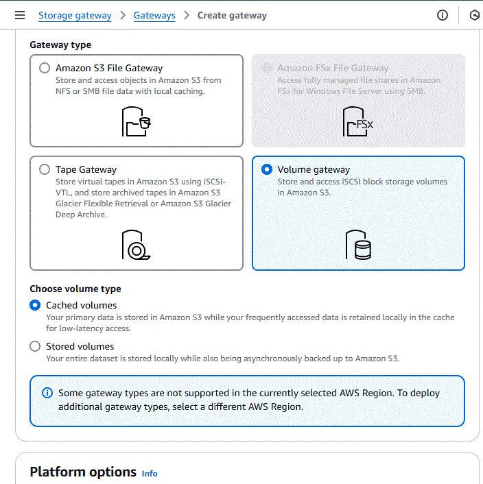
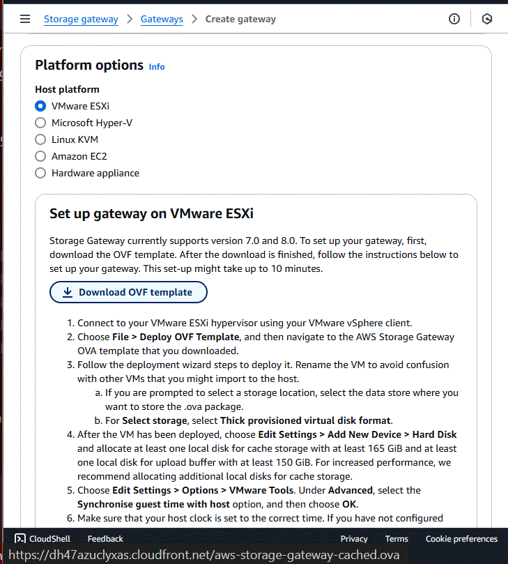

Advanced_Architecting_27112024.md

Advanced Architecting on AWS 2024 - Start Date: 27 November 2024

[Unofficial Introduction to the course](./00-Personal_Taughts_28042024.pdf)

AWS Blogs en Español - Link: [AWS Blogs](https://aws.amazon.com/es/blogs/aws-spanish/)

27-Nov, 2-4-11-16-18 Dec/2024
6-8-13-15 Jan/2025

---

**Table of Contents**
- [The exam and the course](#the-exam-and-the-course)
- [Module 1: Review Architecting Concepts](#module-1-review-architecting-concepts)
- [Module 2: Single To Multiple Accounts](#module-2-single-to-multiple-accounts)
  - [Multiaccount strategies](#multiaccount-strategies)
  - [Identity Center](#identity-center)
  - [Control Tower](#control-tower)
- [Module 3: Hybrid Connectivity](#module-3-hybrid-connectivity)
  - [Client VPN](#client-vpn)
  - [Site-To-Site VPN](#site-to-site-vpn)
  - [Direct Connect](#direct-connect)
  - [Transit Gateway](#transit-gateway)
  - [Route 53 Private Resolver](#route-53-private-resolver)
- [Module 4: Specialized Infrastructure](#module-4-specialized-infrastructure)
  - [Storage Gateway](#storage-gateway)
  - [VmWare Cloud on AWS](#vmware-cloud-on-aws)
  - [Outposts](#outposts)
  - [Local Zones](#local-zones)
  - [Wavelength](#wavelength)
- [Module 5: Connecting Networks](#module-5-connecting-networks)
  - [Transit Gateway](#transit-gateway-1)
  - [Resource Access Manager](#resource-access-manager)
  - [PrivateLink](#privatelink)

---

## The exam and the course

 AWS Solutions Architect Professional - Note Prerequisites - Link: [Exam Guide](https://d1.awsstatic.com/training-and-certification/docs-sa-pro/AWS-Certified-Solutions-Architect-Professional_Exam-Guide.pdf)

Exam Prep: AWS Certified Solutions Architect - Professional - 5h - Link: [Digital Training](https://explore.skillbuilder.aws/learn/course/external/view/elearning/14951/exam-prep-aws-certified-solutions-architect-professional-sap-c02)

 Advanced Architecting on AWS - Link: [Course Outline](https://d1.awsstatic.com/training-and-certification/classroom-training/advanced-architecting-on-aws.pdf)

 Advanced Architecting on AWS - Online Course Supplement - Link: [Digital Training](https://explore.skillbuilder.aws/learn/course/8319/play/75962/architecting-on-aws-online-course-supplement)

Advanced Architecting on AWS - Online Course Supplement - All Languages - Link: [Digital Training](https://www.aws.training/Details/eLearning?id=56205)

## Module 1: Review Architecting Concepts

 Compare Options for VPC Endpoint for S3 - Link: [Official Blog](https://aws.amazon.com/blogs/architecture/choosing-your-vpc-endpoint-strategy-for-amazon-s3/)

 High availability for Amazon Aurora - Link: [Official Docs](https://docs.aws.amazon.com/AmazonRDS/latest/AuroraUserGuide/Concepts.AuroraHighAvailability.html)

Understand Amazon Aurora high availability and disaster recovery from an Oracle perspective - Link: [Official Blog](https://aws.amazon.com/blogs/database/understand-amazon-aurora-high-availability-and-disaster-recovery-from-an-oracle-perspective/)

**QUESTIONS**:

**a) Como se puede habilitar cache en el API Gateway ?**

R:/ Aqui esta el [documento oficial](https://docs.aws.amazon.com/apigateway/latest/developerguide/api-gateway-caching.html)

**b)Como se podria configurar un healthcheck desde DNS ?**

R:/Se puede mirar las configuraciones del [healthcheck en Route 53](https://docs.aws.amazon.com/Route53/latest/DeveloperGuide/health-checks-types.html), a que elementos se apuntan y adicionalmente si es necesario configurarlo con un servicio manejo para garantizar HA en multiAZ o multiregion se puede aplicar [ARC](https://docs.aws.amazon.com/r53recovery/latest/dg/what-is-route53-recovery.html).

## Module 2: Single To Multiple Accounts

Providing access to an IAM user in another AWS account that you own - Link: [IAM Docs](https://docs.aws.amazon.com/IAM/latest/UserGuide/id_roles_common-scenarios_aws-accounts.html)

Switching to an IAM role (AWS API) - Link: [Official Docs](https://docs.aws.amazon.com/IAM/latest/UserGuide/id_roles_use_switch-role-api.html

Delegate Access across AWS Accounts Using IAM Roles: Switch Roles (Console) - Link: [Official Docs] (https://docs.aws.amazon.com/IAM/latest/UserGuide/tutorial_cross-account-with-roles.html)

Comparing AWS Deployment Tools to Manage Multiple Accounts - Link: [AWS re:Invent 2020 Video](https://youtu.be/n_6QTYDavrM)

 Policy Evaluation: IAM, Permission Boundaries, SCP - Link: [Official Doc](https://docs.aws.amazon.com/IAM/latest/UserGuide/reference_policies_evaluation-logic.html)

### Multiaccount strategies

 Establishing Your Best Practice AWS Environment- Link: [Official Docs](https://aws.amazon.com/organizations/getting-started/best-practices/)

Best Practices for Securing Your Multi-Account Environment  - Link: [AWS re:Invent 2020 Video](https://youtu.be/ip5sn3z5FNg)

 Cross-Account IAM Roles - Link: [Official Docs](https://docs.aws.amazon.com/IAM/latest/UserGuide/tutorial_cross-account-with-roles.html)

Delegate Access across AWS Accounts Using IAM Roles: Switch Roles (Console) - Link: [Official Tutorial](https://docs.aws.amazon.com/IAM/latest/UserGuide/tutorial_cross-account-with-roles.html#tutorial_cross-account-with-roles-3).

Permissions Boundaries Exercise - Link: [AWS Live re:Inforce Video](https://www.youtube.com/watch?v=eVNvjQ0wr84)

### Identity Center

AWS Organizations - Link: [Official FAQs](https://aws.amazon.com/organizations/faqs/)

Creating and Managing an Organization - Link: [Official Docs](https://docs.aws.amazon.com/organizations/latest/userguide/orgs_manage_org.html)

 Best Practices for AWS Organizations - Link: [Official Doc](https://docs.aws.amazon.com/organizations/latest/userguide/orgs_best-practices.html)

 Organizations Concepts - Link: [Official Doc](https://docs.aws.amazon.com/organizations/latest/userguide/orgs_getting-started_concepts.html)

Service Control Policies (SCP) Examples - Link: [Official Doc](https://docs.aws.amazon.com/organizations/latest/userguide/orgs_manage_policies_scps_examples.html)

 AWS Services integrated with Organizations - Link: [Official Doc](https://docs.aws.amazon.com/organizations/latest/userguide/orgs_integrate_services_list.html)

Identity Center - Link: [Official FAQs](https://aws.amazon.com/iam/identity-center/faqs/)

 Understanding Key AWS Single Identity Center Concepts - Link: [Official Doc](https://docs.aws.amazon.com/singlesignon/latest/userguide/understanding-key-concepts.html)

How to create and manage users within AWS IAM Identity Center  - Link: [AWS Security Blog](https://aws.amazon.com/blogs/security/how-to-create-and-manage-users-within-aws-sso/)

Provision users and groups from Active Directory  - Link: [Official Doc](https://docs.aws.amazon.com/singlesignon/latest/userguide/provision-users-groups-AD.html)

 Configure the AWS CLI to use IAM Identity Center token provider credentials with automatic authentication refresh  - Link: [Official Doc](https://docs.aws.amazon.com/cli/latest/userguide/sso-configure-profile-token.html)

### Control Tower

About controls in AWS Control Tower - Link: [Official Doc](https://docs.aws.amazon.com/controltower/latest/userguide/controls.html)

 How AWS Control Tower Works - Link: [Official Doc](https://docs.aws.amazon.com/controltower/latest/userguide/how-control-tower-works.html)

 Best Practices for AWS Control Tower Administrators - Link: [Official Doc](https://docs.aws.amazon.com/controltower/latest/userguide/best-practices.html)

Using Lifecycle Events to Track AWS Control Tower Actions and Trigger Automated Workflows - Link: [Blogs](https://aws.amazon.com/blogs/mt/using-lifecycle-events-to-track-aws-control-tower-actions-and-trigger-automated-workflows/)

Proactive Controls on Control Tower User Guide - Link: [Official Doc](https://docs.aws.amazon.com/controltower/latest/userguide/proactive-controls.html)

**QUESTIONS**:

**a) Cual es costo de transferencia de datos en la misma region ?**

R:/ La mejor guia que encontre esta en este [blog](https://aws.amazon.com/blogs/architecture/overview-of-data-transfer-costs-for-common-architectures/), otros escenarios pueden encontrarse en la [documentacion oficial](https://docs.aws.amazon.com/cur/latest/userguide/cur-data-transfers-charges.html).

**b) Se puede personalizar Control Tower?**

R:/ Si, se puede mirar el video de Re:Invent 2021 y la [documenacion oficial](https://docs.aws.amazon.com/controltower/latest/userguide/cfct-overview.html), o la [pagina de implementaciones](https://aws.amazon.com/solutions/implementations/customizations-for-aws-control-tower/).

**c) Como se puede conectar el VPN con Transit Gateway?**

R:/ En este [whitepaper](https://docs.aws.amazon.com/whitepapers/latest/aws-vpc-connectivity-options/aws-transit-gateway-vpn.html) se encuentra este y otros escenarios, y las instructtiones se encuentran [aqui](https://docs.aws.amazon.com/vpc/latest/tgw/tgw-vpn-attachments.html).

## Module 3: Hybrid Connectivity

Hybrid Connectivity - Link: [Whitepaper](https://docs.aws.amazon.com/whitepapers/latest/hybrid-connectivity/hybrid-connectivity.html)

 Amazon Virtual Private Cloud Connectivity Options - Link: [Whitepaper](https://docs.aws.amazon.com/whitepapers/latest/aws-vpc-connectivity-options/welcome.html)

### Client VPN

AWS Client VPN Administrator Guide - Link: [Official Doc](https://docs.aws.amazon.com/vpn/latest/clientvpn-admin/what-is.html)

Accelerated Site-to-Site VPN Connections - Link: [Official Doc](https://docs.aws.amazon.com/vpn/latest/s2svpn/accelerated-vpn.html)

ClientVPN Rules & Best Practices - Link: [Official Doc](https://docs.aws.amazon.com/vpn/latest/clientvpn-admin/what-is-best-practices.html)

Client VPN Scenarios and examples - Link: [Official Doc](https://docs.aws.amazon.com/vpn/latest/clientvpn-admin/scenario.html)

NAT-Transversal - Link: [Wikipedia](https://en.wikipedia.org/wiki/NAT_traversal)

### Site-To-Site VPN

Site-to-Site VPN Tunnel Initiation Options - Link: [Official Doc](https://docs.aws.amazon.com/vpn/latest/s2svpn/initiate-vpn-tunnels.html)

Customer Gateway Options for Your Site-to-Site VPN Connection - Link: [Official Doc](https://docs.aws.amazon.com/vpn/latest/s2svpn/cgw-options.html)

Improve VPN Network Performance of AWS Hybrid Cloud with Global Accelerator - Link: [Official Doc](https://aws.amazon.com/blogs/architecture/improve-vpn-network-performance-of-aws-hybrid-cloud-with-global-accelerator)

Site-to-Site VPN routing options - Link: [Official Doc](https://docs.aws.amazon.com/vpn/latest/s2svpn/VPNRoutingTypes.html)

### Direct Connect

 FAQs: AWS Direct Connect: - Link: [Official FAQs](https://aws.amazon.com/directconnect/faqs/)

 Hosted virtual interfaces on VIF - Note IP Requisites - Link: [Official Doc](https://docs.aws.amazon.com/directconnect/latest/UserGuide/WorkingWithVirtualInterfaces.html#hosted-vif)

Traffic encription Options for DC - Link: [Official Doc](https://d1.awsstatic.com/architecture-diagrams/ArchitectureDiagrams/traffic-encryption-options-direct-connect-ra.pdf)

Un necesario RFC sobre BGP: AS Path Prepending - Link: [Unofficial Blog](https://blog.lacnic.net/un-necesario-rfc-sobre-bgp-as-path-prepending/#:~:text=El%20AS%20Path%20Prepending%20es,para%20el%20tr%C3%A1fico%20entrante%2Fsaliente.)

### Transit Gateway

 Amazon Virtual Private Cloud Connectivity Options - Link: [Whitepaper](https://docs.aws.amazon.com/whitepapers/latest/aws-vpc-connectivity-options/aws-direct-connect-aws-transit-gateway.html)

 Scaling VPN throughput using AWS Transit Gateway  - Link: [Official Doc](https://aws.amazon.com/blogs/networking-and-content-delivery/scaling-vpn-throughput-using-aws-transit-gateway/)

Create a private IP AWS Site-to-Site VPN over AWS Direct Connect: Step-by-step  - Link: [User Guid](https://docs.aws.amazon.com/vpn/latest/s2svpn/private-ip-dx-steps.html)

### Route 53 Private Resolver

 Working with Private Hosted Zones - Link: [Official Doc](https://docs.aws.amazon.com/Route53/latest/DeveloperGuide/hosted-zones-private.html)

 Resolving DNS Queries between VPCs and Your Network - Link: [Official Doc](https://docs.aws.amazon.com/Route53/latest/DeveloperGuide/resolver.html)

Getting Started with Route 53 Resolver - Link: [Official Doc](https://docs.aws.amazon.com/Route53/latest/DeveloperGuide/resolver-getting-started.html)

## Module 4: Specialized Infrastructure

Hybrid Cloud with AWS - Link: [Whitepaper](https://d1.awsstatic.com/whitepapers/hybrid-cloud-with-aws.pdf?did=wp_card&trk=wp_card)

### Storage Gateway

Tag: AWS File Gateway Tag on Blogs - Link: [AWS Storage Blog](https://aws.amazon.com/blogs/storage/tag/aws-file-gateway/)

AWS Storage Gateway - Link: [Official FAQs](https://aws.amazon.com/storagegateway/faqs/)

AWS DataSync FAQ, specially "When to choose AWS DataSync" section  - Link: [Official FAQs](https://aws.amazon.com/datasync/faqs/) 

 AWS Storage Gateway Primer: File Gateway - Link: [Official Training](https://www.aws.training/Details/Curriculum?id=38145)

 Deep Dive into AWS Storage Gateway - Link: [Official Training](https://www.aws.training/Details/Curriculum?id=19403)

### VmWare Cloud on AWS

VMware Cloud on AWS, see Notes  - Link: [Official FAQs](https://aws.amazon.com/vmware/faqs/)

VMware Cloud on AWS, according Broadcom  - Link: [Official Broadcom Page](https://vmc.vmware.com/infrastructure/aws/overview)

Enabling Business Continuity with VMware Cloud on AWS - Link: [AWS re:Invent 2020](https://youtu.be/w2mD0Z5eh6o)

Migrate and Modernize with VMware Cloud on AWS - Link: [AWS re:Invent 2020](https://youtu.be/FQ_u9KsyQyE)

### Outposts

AWS resources on Outposts - Link: [Official Docs](https://docs.aws.amazon.com/outposts/latest/userguide/what-is-outposts.html#services)

AWS Outposts Servers features  - Link: [Official Docs](https://aws.amazon.com/outposts/servers/features/)

AWS Outposts Servers in Two Form Factors - Link: [AWS Blogs](https://aws.amazon.com/blogs/aws/new-aws-outposts-servers-in-two-form-factors/)

AWS Outposts: Storage Foundations - Amazon S3 on Outposts - Link: [AWS Online Tech Talks](https://youtu.be/A_khazmf6jU)

### Local Zones

Delivering low-latency applications at the edge - Link: [AWS re:Invent 2030 Video](https://www.youtube.com/watch?v=isYOTxCm5w4)

### Wavelength

Telecom Reference for AWS - Link: [Official Page](https://aws.amazon.com/telecom/resources/)

At the cutting edge: AI driven sustainable 5G networks - Link: [AWS re:Invent 2023 Video](https://www.youtube.com/watch?v=uG70n3vJLzc)

AWS Wavelength: Run Apps with Ultra-Low Latency at 5G Edge - Link: [AWS re:Invent 2020 Video](https://youtu.be/AQ-GbAFDvpM)

Architecting 5G Apps for Ultra-Low Latency on AWS Wavelength - Link: [AWS re:Invent 2020 Video](https://youtu.be/KZX5FcsDfUQ)

**QUESTIONS**:

**a) En el Escenario 4 de Direct Connect, VPN over Public VIF. Necesito IP Publica para mi Customer Gateway (CPE) ?**

R:/ Si, aunque la definicion que da AWS es Internet-Routable IP, es porque es necesario que el circuito VPN encuentra la IP, como es un Public VIF es necesario que se pueda ver. En este [AWS Re:Post 1](https://repost.aws/knowledge-center/create-vpn-direct-connect) nos pide en el paso 3 del Public VIF que configuremos la IP Publica, finalmente en un caso de uso de [AWS Re:Post 2](https://repost.aws/questions/QUqpca6CqRRN6EanTaP10Wdg/direct-connect-public-vif) es mas especifico y al decir que cualquier Public VIF necesita IPs publicas tanto del lado de AWS (todos los servicios alcanzables) como del Customer Gateway por tanto, son necesario. Finalmente, desde [esta pagina](https://repost.aws/questions/QUo78M4QPDRiaVOKMDu0xiSw/vpn-s2s-with-public-vif-enabled) asumen la condicion del CPE para conectar hacia la IP Publica para la salida de trafico. Otra manera de verlo es que la VPN Site-2-Site necesita una tipo de IP en ambos lados para poder intercambiar las llaves de encripcion, en el caso de que el canal sea un Public VIF se necesita que ambos sean publicas, ya que el Public VIF alcanza todos los servicios con endpoints publicos y en este caso en especifico seria la IP del Virtual Private Gateway publico.

**b) Donde se encuentran la ruta para descargar las imagenes del Storage Gateway ?**

R:/ Las imagenes de las maquinas virtuales se descargan cuando se habilita el Storage Gateway, un ejemplo se puede ver en  y .

**c) Donde se encuentran la ruta para descargar las imagenes del Storage Gateway ?**

R:/ DataSync tiene optimizacion de red que permite usar canal de 10GBps, se puede mirar en su pagina de [Caracteristicas](https://aws.amazon.com/datasync/features/) y en el [FAQs](https://aws.amazon.com/datasync/faqs/), seccion de "When to choose AWS DataSync".

## Module 5: Connecting Networks

 Building a Scalable and Secure Multi-VPC AWS Network Infrastructure - Link: [Whitepaper](https://docs.aws.amazon.com/whitepapers/latest/building-scalable-secure-multi-vpc-network-infrastructure/building-scalable-secure-multi-vpc-network-infrastructure.pdf)

### Transit Gateway

 FAQs: AWS Transit Gateway - Link: [Official FAQs](https://aws.amazon.com/transit-gateway/faqs/)

 Transit Gateway Guide: Examples - Link: [Official Doc](https://docs.aws.amazon.com/vpc/latest/tgw/TGW_Scenarios.html)

VPC Peering vs Transit Gateway with Simple Analogies - Link: [Community Blog](https://community.aws/content/2nrZ0lMno8jnIhR8IAWaP4IL5FN/vpc-peering-vs-transit-gateway-with-simple-analogies?lang=en)

AWS Direct Connect gateways and transit gateway associations - Link: [Official Doc](https://docs.aws.amazon.com/directconnect/latest/UserGuide/direct-connect-transit-gateways.html)

Field Notes: Working with Route Tables in AWS Transit Gateway - Link: [Architecture Blog](https://aws.amazon.com/blogs/architecture/field-notes-working-with-route-tables-in-aws-transit-gateway/)

Advanced Architectures with AWS Transit Gateway - Link: [AWS Online Tech Talks](https://youtu.be/awrdICiS6ug)

Transit Gateway Networking and Scaling - Link: [Training](https://www.aws.training/Details/eLearning?id=40275)

### Resource Access Manager

 FAQs: AWS Resource Access Manager - Link: [Official FAQs](https://aws.amazon.com/ram/faqs/)

How do I share my transit gateway with another account or within an AWS Organization? - Link: [Re:Post](https://repost.aws/knowledge-center/transit-gateway-sharing)

Sharing Your AWS Resources - Link: [Official Doc](https://docs.aws.amazon.com/ram/latest/userguide/getting-started-sharing.html)

Shareable AWS Resources - Link: [Official Doc](https://docs.aws.amazon.com/ram/latest/userguide/shareable.html)

### PrivateLink

Gateway endpoints: Is VPC Gateway Endpoint use PrivateLink? - Link: [Official Doc](https://docs.aws.amazon.com/vpc/latest/privatelink/gateway-endpoints.html)

 Integrating AWS Transit Gateway with AWS PrivateLink and Amazon Route 53 Resolver - Link: [BigData Blog](https://aws.amazon.com/blogs/big-data/how-goldman-sachs-builds-cross-account-connectivity-to-their-amazon-msk-clusters-with-aws-privatelink/)

 Configure and Deploy AWS PrivateLink - Link: [Training](https://www.aws.training/Details/eLearning?id=54077)

Supported Services - Link: [Official Doc](https://docs.aws.amazon.com/vpc/latest/privatelink/aws-services-privatelink-support.html)

Identity-based policy examples for AWS PrivateLink - Link: [Official Doc](https://docs.aws.amazon.com/vpc/latest/privatelink/security_iam_id-based-policy-examples.html)

Learn About Private Endpoints in Atlas (AWS Partner Solution) - Link: [Official Doc](https://www.mongodb.com/docs/atlas/security-private-endpoint/)

VPC Endpoint Services for Interface Endpoints - Link: [Official Doc](https://docs.aws.amazon.com/vpc/latest/userguide/endpoint-service-overview.html)
